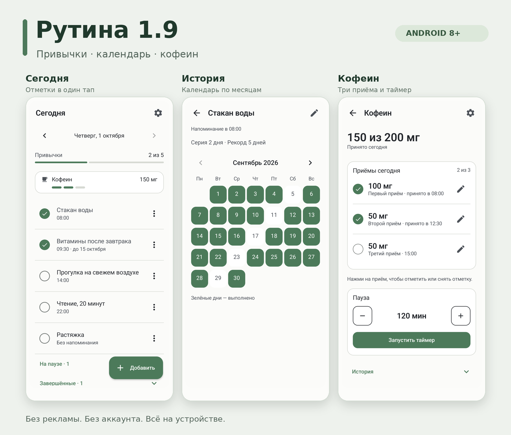
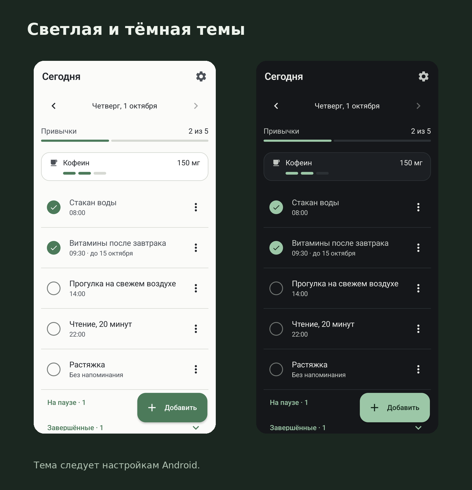

# Рутина

**Простой трекер ежедневных привычек для Android.**

План на сегодня, отметки выполнения и история — в одном приложении.

[**Скачать для Android**](https://github.com/arttvad9r/Rutina/releases/latest) · [Как начать](#как-начать) · [Что нового](docs/releases/v1.10/README.md)

Android 8.0+ · Без регистрации · Без рекламы · Работает без интернета

## Зачем нужна Рутина

Когда хочется регулярно читать, гулять или делать зарядку, полезно иметь перед глазами
короткий план дня и видеть, что уже выполнено. Рутина помогает собрать такие действия
в один список, напомнить о них в нужное время и сохранить историю отметок.

Добавьте свои привычки, отмечайте выполнение одним нажатием и заглядывайте в календарь,
чтобы увидеть, как шли дела за месяц. Можно вести постоянные привычки и временные курсы.

## Что можно отслеживать

| Пример | Как использовать Рутину |
| --- | --- |
| Читать по 20 минут вечером | Добавить привычку и вечернее напоминание |
| Каждый день выходить на прогулку | Отмечать выполнение и смотреть историю за месяц |
| Делать упражнения в течение двух недель | Задать курс на 14 дней и видеть дату окончания |
| Следить за количеством кофеина | Включить дополнительный трекер и отмечать приёмы |

Список при первом запуске пустой: вы сами выбираете, что отслеживать.

## Как это работает

### Сегодня — всё нужное под рукой

Главный экран показывает привычки на выбранный день и общий прогресс. Нажмите на кружок,
чтобы отметить выполнение; повторное нажатие снимает отметку. Для привычки можно включить
ежедневное напоминание, а из уведомления — отметить выполнение или отложить его на 15 минут.

Если забыли поставить отметку вчера, переключитесь на прошлую дату. Новую привычку можно
добавить в любой момент кнопкой «Добавить».

### Календарь — история каждой привычки

Нажмите на название, чтобы открыть календарь по месяцам. Зелёные дни показывают выполнение;
рядом видны текущая серия и рекорд. Здесь же можно поправить отметку за прошлый день.

### Курсы, пауза и завершение

Привычка может быть бессрочной или длиться заданное число дней. Есть быстрый выбор
7, 14 и 30 дней и точная дата окончания. Когда курс заканчивается, история остаётся.

Меню «⋮» на главной позволяет поставить привычку на паузу, возобновить или завершить её.
Привычки на паузе и завершённые находятся в свёрнутых группах, чтобы ежедневный список
оставался компактным.

### Кофеин — дополнительная функция

Если нужен учёт кофеина, включите трекер в настройках. Вы задаёте дневной план,
а приложение раскладывает его на приёмы: например, **200 мг → 100 + 50 + 50**
или **400 мг → 150 + 150 + 100**. Для планов 50 и 100 мг используются один и два приёма.

Каждый приём отмечается одним нажатием. Можно изменить дозу с шагом 50 мг и поправить
фактическое время. На главной видны принятые миллиграммы и отметки приёмов;
на отдельном экране — история и таймер паузы.

Трекер можно выключить: он исчезнет с главной, а записи сохранятся.

## Резервная копия и перенос на другой телефон

В настройках можно экспортировать привычки, отметки, записи кофеина и настройки
в один JSON-файл. Сохраните его в выбранной папке, а на другом телефоне откройте
через «Импортировать данные».

Перед восстановлением приложение проверит файл и покажет число привычек и записей.
Импорт полностью заменяет текущие данные и требует подтверждения. Напоминания
восстанавливаются, запущенный таймер не переносится. Если текущая история нужна,
сначала сохраните её экспортом.

## Светлая и тёмная темы

Приложение следует теме Android. Списки и формы прокручиваются, а интерфейс проверен
на компактном экране и с крупным системным шрифтом.

[Посмотреть все экраны](docs/releases/v1.9/screenshots/). На скриншотах — демонстрационные данные.

## Как начать

1. Откройте [последний релиз](https://github.com/arttvad9r/Rutina/releases/latest) и скачайте основной APK **без `-debug` в названии**. Для версии 1.10 это `Rutina-1.10.apk`.
2. Откройте APK на телефоне и установите приложение. Если Android попросит, разрешите установку этому браузеру или файловому менеджеру.
3. Добавьте привычки кнопкой «Добавить». Напоминание и ограничение срока необязательны.
4. Отмечайте выполненное кружком на главной. Нажмите на название, чтобы посмотреть историю.

Для напоминаний и сигнала таймера разрешите уведомления. Трекер кофеина включается
отдельно в настройках.

<strong>Как обновить установленную версию</strong>

Установите новый APK поверх старого: привычки, отметки и записи кофеина сохранятся.

Если раньше была установлена debug-сборка, выберите APK с `-debug` в названии.
Release и debug подписаны разными ключами и не обновляют друг друга. Не удаляйте
приложение ради смены типа сборки: это удалит локальные данные.

## Ваши данные

Привычки и отметки хранятся на устройстве. В приложении нет регистрации, рекламы
и аналитики; оно работает без интернета и не запрашивает разрешение на доступ к сети.
Исходный код доступен в этом репозитории.

## Разработка и обратная связь

Нашли ошибку или хотите предложить улучшение? [Создайте issue](https://github.com/arttvad9r/Rutina/issues/new)
и опишите, что произошло, указав модель телефона и версию Android.

Разработчикам: [сборка, тесты и подпись APK](docs/DEVELOPMENT.md).
Приложение написано на Kotlin с Jetpack Compose и Room.
