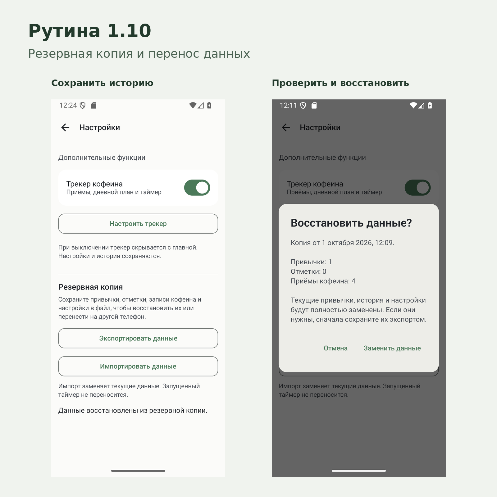

# Рутина 1.10 — импорт и экспорт данных

В Рутине можно сохранить всю историю в файл и восстановить её на другом телефоне.
В настройках появился раздел **«Резервная копия»**. Интернет и аккаунт не нужны.

**[Скачать Рутина 1.10 для Android](https://github.com/arttvad9r/Rutina/releases/download/v1.10/Rutina-1.10.apk)** · Android 8.0 и новее

## Что нового

- **Экспортировать данные** — сохранить привычки, отметки, историю кофеина и настройки в один JSON-файл через системный выбор папки.
- **Импортировать данные** — выбрать файл и проверить дату копии, количество привычек, отметок и приёмов кофеина перед восстановлением.
- Переносятся сроки, пауза и завершение привычек, напоминания и корректировки доз кофеина. Напоминания после восстановления включаются заново.
- Повреждённые и несовместимые файлы отклоняются до изменения данных. Восстановление выполняется целиком одной операцией.

**Импорт полностью заменяет текущие данные** и требует подтверждения. Если текущая история нужна, сначала сохраните её экспортом. Запущенный таймер не переносится.

## Как перенести данные

1. На старом телефоне откройте настройки и нажмите **«Экспортировать данные»**.
2. Сохраните файл и передайте его на новый телефон удобным способом.
3. На новом телефоне установите Рутину и выберите **«Импортировать данные»**.
4. Проверьте сведения о копии и подтвердите **«Заменить данные»**.

Файл копии содержит вашу историю и настройки в открытом виде. Храните его там, где храните остальные личные файлы.

## Установка и обновление

Скачайте **Rutina-1.10.apk** и установите поверх прежней release-версии. Подпись сохранена; существующие данные сохраняются при обновлении.

Если раньше была установлена debug-сборка, используйте **Rutina-1.10-debug.apk**. Release и debug подписаны разными ключами. Не удаляйте приложение ради смены типа сборки: это удалит локальные данные.

## Файлы релиза

| Файл | Назначение |
| --- | --- |
| [Rutina-1.10.apk](https://github.com/arttvad9r/Rutina/releases/download/v1.10/Rutina-1.10.apk) | Основная подписанная сборка |
| [Rutina-1.10-debug.apk](https://github.com/arttvad9r/Rutina/releases/download/v1.10/Rutina-1.10-debug.apk) | Обновление прежней debug-сборки |
| [Rutina-1.10-screenshots.zip](https://github.com/arttvad9r/Rutina/releases/download/v1.10/Rutina-1.10-screenshots.zip) | Скриншоты и обложка |
| [SHA256SUMS.txt](https://github.com/arttvad9r/Rutina/releases/download/v1.10/SHA256SUMS.txt) | Контрольные суммы файлов |

## Проверено перед публикацией

- **63 модульных теста прошли**, lint не обнаружил ошибок; release APK собран с R8.
- Подпись APK совпадает с релизом 1.9.
- На эмуляторе OnePlus 13s (Android 16) проверены экспорт, предпросмотр, отмена и восстановление; все переносимые поля совпали после цикла импорт → экспорт, включая подписанную release-сборку.
- Проверены повреждённые файлы, неподдерживаемая версия, лимит 10 МБ, пустая копия и отмена активного таймера.
- Диалог восстановления проверен со шрифтом 150%.

Реальный телефон и Android 8 в этой проверке не использовались.

[Подробный отчёт о проверке](../../data-backup/VERIFICATION.md) · [О приложении](../../../README.md) · [Изменения исходного кода](https://github.com/arttvad9r/Rutina/compare/v1.9...v1.10)
